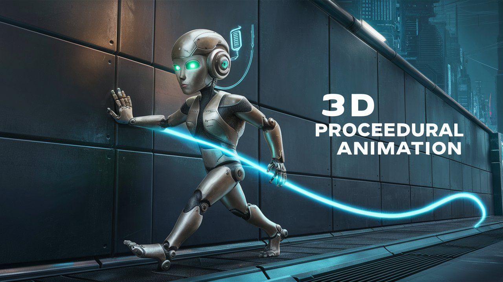

  

# 3D-Procedural-Animation
3D Procedural Animation system focuses on achieving natural, responsive, and contextually-driven animations for characters. By utilizing procedural animation techniques, we aim to create animations that adapt to the environment and player actions in real-time, enhancing the overall immersion and gameplay experience.

# Features
- Player's hand: Dynamically generated animations based on environmental interactions and player input.

https://github.com/gr4ndsmurf/3D-Procedural-Animation/assets/83185792/410d6f58-546d-46e6-982d-7c45ac7b2bb1

# Coming Soon
- Mech movement.
- Spider movement.

# Feedback
I'd love to hear your feedback! If you have any questions, suggestions, or issues, please create an issue or reach out to me directly.

Happy animating! 🎮🚀
